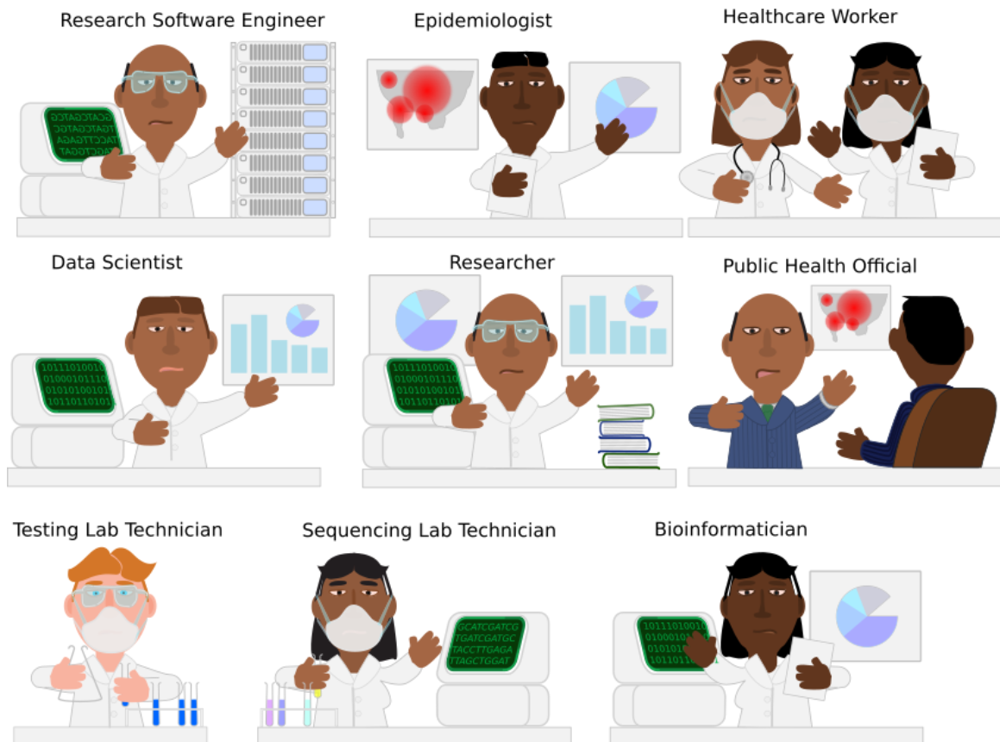

### Genomic Epidemiology: What and Why?

In May 2022, the World Health Organisation published a [global genomic surveillance strategy](https://www.who.int/initiatives/genomic-surveillance-strategy), cementing
the place of genomic sequencing in the mainstream of public health surveillance. This follows a little over a decade after Mark Pallen and Nick Loman 
[asked](https://link.springer.com/article/10.1186/gm269) if we were "on the brink of a revolution in diagnostic and public health microbiology, in which high-throughput sequencing usurps the traditional 'M, C & S' [microscopy, culture and antibiotic susceptibility testing]"? While genomic sequencing, and especially whole genome sequencing,
of pathogenic microorganisms, has not yet become a front-line diagnostic tool in most of the world, the use of genomic sequences in public health for genomic
epidemiology has become ever-more prevalent.

Genomic epidemiology extends techniques common to the broader field of epidemiology, that is the study of the incidence, distribution and possible control of diseases and other factors related to health. To the standard epidemiological toolbox of case investigation and reporting, epi curves and epidemiological links, genomic sequencing adds insights from pathogen genomic data. This is well illustrated in this figure from Allison Black and Gytis Dudas' [Applied Genomic Epidemiological Handbook](https://alliblk.github.io/genepi-book/).





The curve of reported cases in Figure 1 seems to illustrate a single outbreak (which is perhaps coming to an end), whereas the curve that includes genotyping data illustrates that in fact three separate introduction events and thus overlapping outbreaks have occurred. While genotyping is possible without whole genome sequencing (WGS), WGS provides higher resolution than other methods, as will be discussed below.

#### Applications of genomic epidemiology

Generally speaking, applications of genomic epidemiology can be classified into two categories: surveillance and outbreak response. These can be distinguished by the turnaround time and sampling strategies required.

For surveillance, samples are chosen from a broad population using strategies such as setting up surveillance sites or selecting samples associated with "notifiable diseases". The sampling strategy typically aims to be representative of the population. Surveillance outcomes can include:

* Discovery of novel pathogens or novel variants of known pathogens

* Changes in prevalence of pathogen strains (i.e. variants)

##### The case of D614G

The collection of this data is only the first step towards interpretation and decision making. Pathogen sequence data is, by itself, seldom information. Especially in fast evolving organisms like viruses, nucleotide mutations occur frequently and sometimes result in amino acid changes. One of these was the change in codon 614 of the SARS-CoV-2 spike
protein from aspartic acid (IUPAC symbol D) to glycine (G). This S:D614 mutation was noticed early in 2020 and in April 2020, a group of researchers 
[suggested](https://www.biorxiv.org/content/10.1101/2020.04.29.069054v2) that it was driving increased transmission of the virus. Their work was subject to considerable
debate, with some suggestion that D614G, like the earlier S:L84S mutation, was the result of a "founder effect", where the increased prevalence of a particular mutation
(or combination of mutations) is the result of events (e.g. air travel) associated with disease transmission rather than any change in characteristics of the pathogen itself.

As D614G-containing strains increased in frequency in [every country](https://www.nature.com/articles/s41598-020-70827-z) sequencing SARS-CoV-2 genomes, the significance
of the mutation for viral fitness was confirmed. The mutation has thus become "fixed" in the viral population.

The growing certainty around the significance of the D614G variation relied on viral WGS data being combined with contextual data (also known as metadata) from multiple countries.
This contextual data included the date and approximate geographic location where virus samples were collected and is, in recent times, shared along with genome sequence 
samples using databases each as the European Nucleotide Archive, Genbank (from the United States of America) and GISAID.

##### Further uses of genomic surveillance

The case of the S:D614G mutation illustrates the use of genomic epidemiology to relate changes in the pathogen sequence to changes in fitness and thus changing
epidemiological parameters (e.g. the "reproductive number" of cases that a single infection is likely to lead to). Later in 2020 the first "variants of concern" (VOCs)
(e.g. [Alpha](https://www.theguardian.com/world/2021/apr/03/has-everyone-in-kent-gone-to-illegal-rave-on-variant-trail-with-covid-detectives), first reported 
in the UK and [Beta](https://www.thelancet.com/journals/langlo/article/PIIS2214-109X(21)00313-2/fulltext), first reported in South Africa). Driven by the selective
pressure of interaction with the human immune system, these VOCs were "immune evasive", even in people who previously were infected with SARS-CoV-2 or (later on) had
been vaccinated. They also illustrate a further use of genomic surveillance: the association of genotype with clinical features.

These clinical features can include:

* Changes in disease severity (e.g. with the [Omicron variant](https://www.medrxiv.org/content/10.1101/2022.01.12.22269148v1) of SARS-CoV-2)

* Changes in relation to immune response, either from [prior infection](https://www.nature.com/articles/s41591-021-01285-x) or [vaccination](https://www.nejm.org/doi/full/10.1056/nejmoa2102214) or [both](https://www.nejm.org/doi/full/10.1056/nejmoa2102214)

* Changing performance of diagnostic assays e.g. for [_P. falciparum_](https://www.nature.com/articles/s41564-021-00962-4) or [rifampicin resistant TB](https://genomemedicine.biomedcentral.com/articles/10.1186/s13073-020-00793-8)

* Changes that impact on treatment efficacy, such as antibiotic resistance in [_M. tuberculosis_](https://www.who.int/publications/i/item/9789240028173) and other bacteria 

In all of these cases, WGS data needs to be combined with other data types (e.g. RDT test performance, or hospital clinical data) in order to reach conclusions. This emphasises
the importance of digitalisation of health systems and establishment of ethical and legal frameworks and infrastructure for data sharing and collaboration between various role
players in the health system.





#### Genomic epidemiology for outbreak response

The discussion thus far have focused on broad, population scale applications of genomic epidemiology. As mentioned, in genomic surveillance a population of
pathogens is sampled and data integrated to come to conclusions about disease prevalence and pathogen characteristics.

In the case of outbreaks, effort is taken to sequence many if not all of the samples of a pathogen in the outbreak in order to understand, in detail, the
relatedness of cases. Such focused attention implies devoting considerable resources, and thus is often restricted to analysis of outbreaks of significance.
This significance can be due to the location of an outbreak, e.g. in a [care home](https://www.cmaj.ca/content/193/19/E681) housing vulnerable people, its
intensity and duration (such as the 2017-2018 [Listeriosis outbreak](https://www.liebertpub.com/doi/10.1089/fpd.2018.2586) in South Africa or 
[MDR TB in Rwanda](https://www.sciencedirect.com/science/article/pii/S2405579422000043)) or the 
appearance of pathogens of special concern (e.g. [Ebola virus disease](https://virological.org/t/april-2022-ebola-virus-disease-case-in-equateur-province-drc-represents-a-new-spillover-event/795)).

In outbreak investigation, WGS is used to provide a high resolution genotyping of isolates of interest, allowing conclusions to be drawn about the likelihood of certain
transmission scenarios. [Black and Gytis](https://alliblk.github.io/genepi-book/the-value-of-pathogen-genomics-in-applied-epidemiology.html#the-value-of-genomic-epidemiology-for-outbreak-response.) illustrate a theoretical outbreak in a workplace where detailed geospatial data (the location of 
work stations in a factory) is combined with genomic data to illustrate that what appeared to be a single transmission event was, likely, the result of multiple.

An examination of the two Ebola outbreaks in the Democratic Republic of Congo - one in North Kivu and a second in Equateur province (both in 2022) illustrates
how WGS pathogen data can shed light on the source of disease. In both cases, the virus genome was amplified from patient samples, sequenced and placed within a
phylogenetic tree together with other previously collected Ebola Zaire virus (EBOV) genome samples.









Both outbreaks samples (and their analysis) were posted on the [virological.org](https://virological.org) discussion forum (founded by Prof Andrew Rambaut in 2014). In the Equateur case, the sample forms a clade distinct from other outbreak samples, illustrating that it (like the 2018 and 2020 outbreaks) represented a new introduction of the virus from an unsampled (zoonotic) reservoir of infection. As of today we don't yet know what that reservoir is, although a bat species, perhaps with an intermediate wildlife host, is suspected.

In the North Kivu case, the sample fits within the genetic diversity of the large 2018-2020 Eastern DRC outbreak, providing evidence that the source of infection was
re-activation of dormant virus without a previously infected individual.

The two scenarios illustrated in the genomic data from outbreak investigation lead could lead to diverging suggestions for public health intervention: strengthened surveillance at the human / wildlife boundary and, in the Eastern DRC case, continued follow-up and enhanced access to care for Ebola survivors, their families and communities.

Both examples of EBOV sequencing also illustrate the importance of not just contextual data about when and where samples were collected, but the importance of building up well annotated databases from outbreaks over time.

### Conclusion

Genomic epidemiology is an emerging field combining the efforts and skills of many different disciplines within the healthcare and public health system. It requires not just sequencing and bioinformatics, but also the development of data standards (for sharing context data), digital infrastructure in healthcare and data sharing mechanisms (both technical and ethical / legal).

The pay-offs from genomic epidemiology are enhanced by preparation, through training and infrastructure development, before outbreaks occur and continual application
of genomic epidemiology to public health disease surveillance.

Further sub-modules will discuss the nature of pathogen genomic data and the different forms of genotyping that can proceed from this data.
