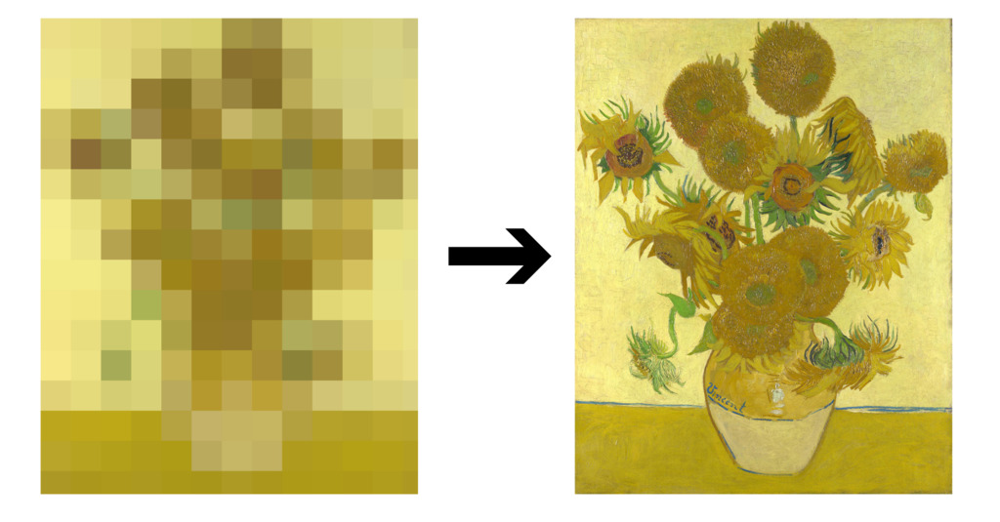
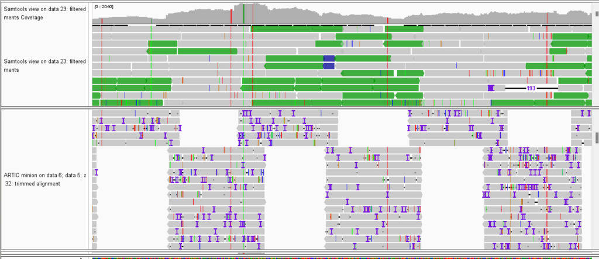
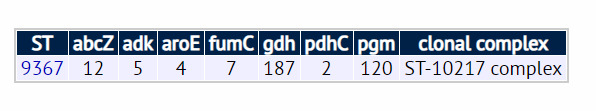

### Genotyping and Sequencing

Genotyping, that is the use of genetic make-up (i.e. DNA patterns) for classifying pathogens, has been used for characterising pathogens and decoding
outbreaks for the past few decades. Techniques such as restriction fragment length polymorphism (RFLP), variable number of tandem repeats (VNTR) sizing,
spoligotyping and pulsed-field gel electrophoresis (PFGE) have been used to type a variety of different bacteria and identify their relatedness.
Multiplex PCR has been used to distinguish pathogens using well-known "marker genes".

All of these techniques use known patterns in the genetic code of target organisms as a basis for classifying them as types, sampling small parts of
the pathogen's genome for classification.

The direct sequencing of pathogens' genomes aims to gain higher resolution in genotyping by sequencing (i.e. "reading") the genomic sequence itself of the
pathogen being examined. Current technologies do not allow the complete genome of a pathogen to be read, but rather generate fragments (called "reads") of
genetic information that are later used to infer the genome (or, in the case of targetted sequencing, parts of the genome). From this reconstructed genome,
bioinformatic methods can then genotype the pathogen with a higher resolution than previous methods.





### Sequencing Technologies

The first widely used sequencing technology was [Sanger sequencing](https://en.wikipedia.org/wiki/Sanger_sequencing) which is able to sequence some hundreds
of base pairs downstream of a given primer match. For the most part Sanger sequencing is restricted to sequencing one or a small number of genes. In this
regard it can be consider a "targeted sequencing" technology. Sanger sequencing produces outputs known as chromatograms of which typically a middle section is
useable to "call" DNA bases. In other words, the output of Sanger sequencing is a small number of high quality sequencing "reads".

Modern whole genome sequencing (WGS) relies on high throughput techniques that can produce hundreds of thousands or millions of sequencing reads spanning
a whole genome. The most commonly used sequencing technologies are those from Illumina and Oxford Nanopore, although other platforms (e.g. from MGI/BGI,
Pacific Biosciences and IonTorrent) do exist.

#### Illumina sequencing

Illumina sequencing, sometimes simply known as "Next Generation Sequencing", produces reads of 75 to 300 base pairs. These reads have highest sequencing
quality near the start of a read with quality dropping off towards the end. Typical individual base calls have 99.9% accuracy. Because sequencing
library preparation involves generating DNA fragments of approximately fixed size, each individual DNA fragment yields pairs of reads, one from either
end of the fragment, with a known "insert size" between them.





Illumina sequencers range in size from desktop devices (like the iSeq, MiSeq and NextSeq) to refrigerator sized units (the NovaSeq range). Run times for sequencing
runs range from 14 hours (for the iSeq 75 base pair reads) to 24 hours or more.

#### Oxford Nanopore sequencing

Oxford Nanopore sequencing is an example of "Third Generation" sequencing that produces reads of hundreds to tens of thousands of base pairs by reading an
electrical signal while moving a DNA (or RNA) molecule through a protein "pore". Like Illumina sequencing, sequencing of multiple reads happens simultaneously
in a massively parallel process. Unlike in Illumina sequencing, single reads are produced from each journey of a DNA molecule through a pore and base
quality is not related to the position of the base in the read.





Oxford Nanopore produces portable (MinION) and benchtop (GridION and PromethION) sequencers. As sequencing output can be examined during the sequencing run,
run time of Oxford Nanopore devices is somewhat variable, with a maximum of 72 hours but a minimum of considerably less, depending on the application. Per
base sequencing quality ranges from 95% (on older R9.4 flow cells) to 99% (on R10 flow cells). Homopolymers (i.e. stretches of the same DNA base) pose a 
particular challenge for Nanopore sequencing and thus false insertions or deletions are common.

### From Sequence to Genotype

As noted above, sequencing produces "sequencing reads" which are combined to reproduce the genome of the organism being sequenced. This combination
typically involves some combination of aligning using a known "reference genome" and computation of overlaps between reads to generate larger 
stretches of contiguous DNA (contigs). The resulting combined reads can be used for genotyping either by single nucleotide variants, by identifying
patterns of known alleles or by other methods such as k-mer comparison or mash distance.

#### Single Nucleotide Variants and Indels

Single nucleotide variants (SNVs) are individually bases that differ between sequencing reads and a comparison genome (typically a "reference genome" of
the organism being studied). The alignment of several (tens to hundreds) of reads against this comparison genome increases the confidence that the SNV
identified is a true SNV and not a sequencing error. In addition to single bases changes, inserted or deleted bases (indels) can sometimes, but more
rarely, be used for genotyping an organism.

When the placement of a nucleotide SNV in the context of a gene sequencing is known (because of annotation of postions of genes on a genome), the
SNVs impact on the amino acid of a protein can be inferred. SNVs can either be synonymous (if they would not change the amino acid) or non-synoymous
(if they would change the amino acid or result in a stop codon).

When taken together, the pattern of SNVs in a genome results in a genotype that in turn can be compared to other known genotypes to infer the relatedness
of pathogen isolates, in a process known as phylogenetics.





#### Alleles and Multilocus Sequence Typing

Genotyping by SNVs always involves the use of a comparison (reference) genome. In some organisms (e.g. SARS-CoV-2 or _M. tuberculosis_) this is the
preferred approach and much knowledge has been gained on the significance of SNVs for, for example, immune evasion or antibiotic resistance. This
approach assumes, however, the existence of an appropriate comparison genome and also that the genome of the isolate being studied contains all
the genetic material of interest.

In many bacteria, species diversity through recombination and the changing complement of mobile genetic elements (e.g. plasmids) present in
the pathogen increases the risk of errors in SNV identification or makes the choice of a reference genome difficult to impossible. Genotyping is
still possible for these organisms by identifying the specific alleles present at particular genomic loci. This approach is called multilocus
sequence typing.

As an illustration, consider meningococcus (_N. meningitidis_). In 1998 Martin Maiden and colleagues [published](https://www.ncbi.nlm.nih.gov/pmc/articles/PMC19708/)
a proposal to use the genomic sequences of the _abcZ_, _adk_, _aroE_, _gdh_, _pdhC_ and _pgm_ genes for genotyping isolates of meningococcus (_fumC_
was added in a subsequent publication). The genes chosen are so-called "housekeeping genes" conserved across most strains of the organism. Each known 
allele (i.e. sequence) for each gene is given a number, and isolates are typed by matching their sequence to these known alleles. The collection of known
alleles and their numbers is known as a _MLST scheme_. A particular known combination of allele numbers identifies as sequence. So long as isolates are
genotyped using the same scheme, they can be compared to one another. The number of loci with different alleles also gives some indication of the degree
of difference between isolates, although it is import to note that nothing can be inferred about the degree of difference that an allele mismatch represents.
Allele 1 is not necessarily more similar to allele 2 than it is to allele 5.





Whole genome sequencing has allowed MLST to expand beyond to core genome MLST (cgMLST) and whole genome MLST (wgMLST) with correspondingly large numbers of
loci. The [PubMLST](https://pubmlst.org/) website stores MLST schemes for over 100 organisms and over 35 million different alleles. By contrast to the seven
gene scheme noted above, the cgMLST scheme for meningococcus available at PubMLST is based on over 1000 loci. Such large cgMLST schemes allow fine resolution
typing of pathogens.

#### K-mers, MinHash, Mash and more

While SNV typing and allele-based MSLT are the most common methods currently used for genotyping pathogens, other sequence comparison techniques are
possible and in use either in research or in specialised contexts. One such technique involves computing the set of sequences of length _k_ from a genome.
These (typically short) sequences are known as _k-mers_ and the number of k-mers that two genome sequences have in common can be used as a measure of
the genetic distance between the two sequences.

Yet other string comparison techniques have been applied to genomic sequences, including the use of the MinHash metric in an approach called
[Mash distance](https://genomebiology.biomedcentral.com/articles/10.1186/s13059-016-0997-x). As with k-mers, this technique allows rapid estimation
of the degree of difference between sequences.

While not currently used for genotyping, these techniques are mentioned because of their importance in emerging bioinformatic techniques for e.g. species or genus
identification and rapid discovery of similar sequences.

### From Genotype to Outbreak Cluster

The identification of genotypes is seldom, in itself, the end goal of sequencing. As described in the previous sub-module, sequencing and genotype
information might be used to infer changes in the circulating population of pathogens, or for outbreak investigation. For these use cases, measures
of similarity can be applied to the genotypes of isolates to identify clusters.





Lineage names, sequence types or positions in clusters are all types of information that can be derived from pathogen sequencing. Methods for computing
such information and the appropriate analysis tools and databases to use in this computation form the basis of the field of pathogen bioinformatics
for public health.
