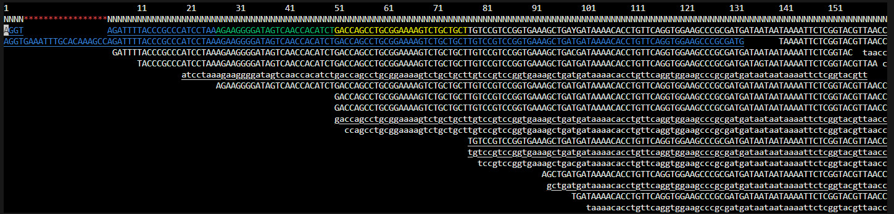

### Mapping and Variant Calling

(adapted from Hadrien Gourle's [original](https://www.hadriengourle.com/tutorials/mapping/))

In this practical you will learn to map NGS reads to a reference sequence, check the output using a viewer software and investigate some aspects of the results.

EHEC O157 strains generally carry a large virulence plasmid, pO157.
Plasmids are circular genetic elements that many bacteria carry in addition to their chromosomes.
This particular plasmid encodes a number of proteins which are known or suspected to be involved in the ability to cause severe disease in infected humans.
Your task in this practical is to map your prepared read set to a reference sequence of the virulence plasmid, to determine if the pO157 plasmid is present in the St. Louis outbreak strain.

---

*Illustration of plasmid integration into a host bacteria*
---

#### Ensure that you are in the correct computing environment

As explained in the [previous submodule](../qc_and_trimming), if you are on our training cluster, ensure that you are using a worker node (i.e. `worker-1`,
`worker-2`, `worker-3` or `worker-4`). Also ensure that you are are in the `qc` conda environment (i.e. you have run `conda activate qc`)

If you are on your own laptop, and you have not done this previously, ensure that you have all the software you need by running:

`mamba create -n mapping -y bowtie2 samtools bcftools` and then use `conda activate mapping` instead of `conda activate qc`

#### Downloading reads

In the [Quality Control](../qc_and_trimming) tutorial you used a subset of 50,000 reads from sample SRR957824. In this tutorial we will use a
collection of about 500,000 reads that have been adapter and quality trimmed. Download the read dataset by going to your `~/work` directory (created
in the previous tutorial) - if you do not have it, create it with `mkdir ~/work`) and downloading running these commands:

```bash
cd ~/work
wget -c https://www.dropbox.com/s/pgh5im31hf27pgt/SRR957824_500K_trimmed_R1.fastq.gz
wget -c https://www.dropbox.com/s/5szt9rneifwmdom/SRR957824_500K_trimmed_R2.fastq.gz
```

#### Downloading a Reference

You will need a reference sequence to map your reads to.

```bash
cd ~/work
wget -O pO157_Sakai.fasta.gz -c https://osf.io/rnzbe/download
```

This file contains the sequence of the pO157 plasmid from the Sakai outbreak strain of E. coli O157.
In contrast to the strain we are working on, this strain is available as a finished genome, i.e. the whole sequence of both the single chromosome and the large virulence plasmid are known.

#### Indexing the reference

Before aligning the reads against a reference, it is necessary to build an index of that reference

```bash
bowtie2-build pO157_Sakai.fasta.gz pO157_Sakai
```

One you have downloaded the two read files and the reference files their md5 checksums should be:

```bash
md5sum SRR957824_500K_trimmed_* pO157_Sakai.fasta.gz
3d3bfefc858c5b2f10985eed97334b84  SRR957824_500K_trimmed_R1.fastq.gz
0d2f830d3ecc8cb3b79142580cbfb510  SRR957824_500K_trimmed_R2.fastq.gz
0a5ab22c7e9b6f77c3bfb262c55e865b  pO157_Sakai.fasta.gz
```

!!! note
    Indexing the reference is a necessary pre-processing step that makes searching for patterns much much faster. Many popular aligners such as Bowtie and BWA use an algorithm called the [Burrows–Wheeler transform](https://en.wikipedia.org/wiki/Burrows–Wheeler_transform) to build the index.

#### Aligning reads

Now we are ready to map our reads

```bash
bowtie2 -x pO157_Sakai -1 SRR957824_500K_trimmed_R1.fastq.gz -2 SRR957824_500K_trimmed_R2.fastq.gz -S SRR957824.sam
```

The output of the mapping will be in the SAM format.
You can find a brief explanation of the SAM format [here](file_formats.md)

!!! note
    In this tutorial as well as many other places, you'll often see the terms *mapping* and *alignment* being used interchangeably. If you want to read more about the difference between the two, I invite you to read this excellent [Biostars discussion](https://www.biostars.org/p/180986/)

#### Visualising with tview

```bash
head SRR957824.sam
```

But it is not very informative.
In a few minutes, we'll use samtools to visualise our data.

Most analysis tools work with BAM, a compressed version of the SAM output that bowtie2 generates. So we need to convert the SAM to BAM using this command:

```bash
samtools view -hSbo SRR957824.bam SRR957824.sam
```

Mapping data from bowtie2 is not sorted but most analysis tools require it to be sorted and indexed. Sort the BAM file per position in the genome and index it

```bash
samtools sort SRR957824.bam -o SRR957824.sorted.bam
samtools index SRR957824.sorted.bam
```

Finally we can visualise with `samtools tview`. This is a text based user interface for viewing BAM files. 

```bash
samtools tview SRR957824.sorted.bam
```






!!! tip
    navigate in tview:  
        - left and right arrows scroll    
        - `q` to quit   
        - `CTRL-h` and `CTRL-l` scrolls more  
        - `g gi|10955266|ref|NC_002128.1|:8000` will take you to a specific location.   

### Variant Calling

A frequent application for mapping reads is variant calling, i.e. finding positions where the reads are systematically different from the reference genome.
Single nucleotide polymorphism (SNP)-based typing is particularly popular and used for a broad range of applications.
For an EHEC O157 outbreak you could use it to identify the source, for instance.

We can call the variants using `samtools mpileup`

```bash
 bcftools mpileup -f pO157_Sakai.fasta.gz SRR957824.sorted.bam | bcftools call -m -v -o SRR957824.vcf
```

Note that `bcftools mpileup` will output the message `maximum number of reads per input file set to -d 250`. 
You can read about the structure of vcf files [here](https://www.hadriengourle.com/tutorials/file_formats/).
The documentation is quite painful to read and take a look at the file

Look at the non-commented lines

```bash
grep -v ^## SRR957824.vcf
```
The first five columns are *CHROM POS ID REF ALT*.

Use

```bash
grep -v ^## SRR957824.vcf | less -S
```

for a better view.

!!! tip
    Use your left and right arrows to scroll horizontally, and `q` to quit.


!!! question
    How many SNPs did the variant caller find? Did you find any indels?

Examine one of the variants with tview

```bash
samtools tview SRR957824.sorted.bam pO157_Sakai.fasta.gz -p 'gi|10955266|ref|NC_002128.1|:43071'
```

Note that this time round, because we have included the reference in our `samtools tview`, positions that match the reference are shown as '.' in a forward
read and ',' in a reverse read. When positions don't match, the base is shown like at position 43071 in our example.

That variant seems very real!

!!! question
    Where do reference genomes come from?