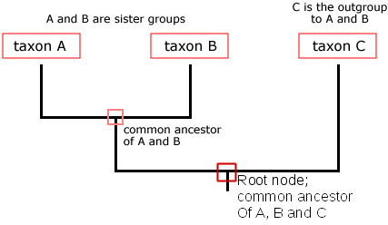

### Introduction to Phylogenomics

Phylogenomics implements various bioinformatic techniques to study the relationship amongst organisms using various types of data. Investigating the evolutionary relationship between organisms aids in identifying the appropriate genealogical ties resulting in evolutionary trees which describes a historical record relating to the the points of divergence between organisms. 

By chronicling these divergence points, researchers aim to develop an understanding of the relatedness of species, how they have evolved over time and to construct the ancestral lineages which give rise to the diversity of life on Earth. Phylogentic analysis is a procedure which involves researchers gathering data from the organisms under investigation, such as DNA sequences, protein sequences, anatomical features, physiological features and paleontological features in tandem with computational tools and statistical methods to infer the similarities and differences among organisms.





The slides from Prof Alan Christoffels talk on _Introduction to Phylogenomics_



Key topics covered in the presentation:

1. Mechanisms of Evolution.

2. Methods for Phylogentic relatedness.

3. Phylogentic tree generation.

4. Applications of phylogenetic trees in disease outbreaks.

### Phyloseminars

The [Phyloseminars](http://phyloseminar.org/index.html) are a series of online seminars on phylogenetics. They are free to attend
and recordings are available online. The "Primer" series are a great introduction:

1. [Primer Part 1:](https://www.youtube.com/watch?v=1r4z0YJq580) tree terminology and substitution models

2. [Primer Part 2:](https://www.youtube.com/watch?v=UsLeY0wZr4Y) tree likelihood and rate heterogeneity

3. [Primer Part 3a:](https://www.youtube.com/watch?v=4PWlnNsfz90) introduction to Bayesian statistics

4. [Primer Part 3b:](https://www.youtube.com/watch?v=TLtOS--YwkU) introduction to Bayesian phylogenetics

