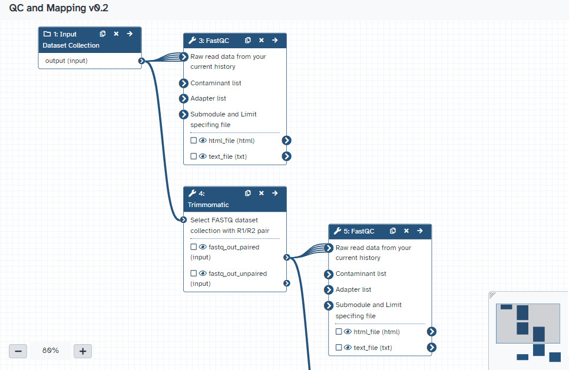

### Organising Data in Galaxy

Galaxy organises data in histories that contain datasets and dataset collection. Each item in the history is stored a single time on disk, i.e.
if a copy is made of a dataset, there is still only one copy of the data stored on disk. This also affects how deletion of datasets works: if a
dataset is deleted, it will not really be deleted if a copy exists in another history.

Galaxy treats the data in each dataset as read only. This means that while metadata, for example, the name of the dataset or its data type, can
change, the data contents of the history will not change. Any operations on the history (for example, changing text in a line) will make a new
history.

For an introduction to how Galaxy histories work, read the [Understanding Galaxy history system](https://training.galaxyproject.org/training-material/topics/galaxy-interface/tutorials/history/tutorial.html) tutorial.

Some tips on how to use histories effectively:

1. Always name your history with an appropriate name and tag histories appropriately so that they are easier to find

2. If you have raw (e.g. sample) data, upload this to a history that will only be used to store this data. Make a copy of the history before using the data in an analysis so that if something goes wrong with the analysis you can always go back to the original data.

3. Each time you are starting a new analysis, start a new history. This way your history does not get over-complicated

4. At the end of an analysis, copy the important result datasets to a new history so that they are easier to find, or tag the datasets to make them easier to find.

Some other slides and tutorials that are useful:

1. [Getting data into Galaxy](https://training.galaxyproject.org/training-material/topics/galaxy-interface/tutorials/get-data/slides.html#1). This mentions a technique we
have often used in the workshop: if someone shares a history with you using a link, you can make a copy of the history so that you can do your own analyses on the shared data.

2. [Searching your history](https://training.galaxyproject.org/training-material/topics/galaxy-interface/tutorials/search/tutorial.html)

#### Dataset collections

Dataset collections allow you to organise your data into groups. Collections make your data organisation neater and also allow you to run analyses in
parallel: most tools that take a collection as input will start analysis jobs for each element of the collection in parallel.

There is a tutorial on [Using dataset collections](https://training.galaxyproject.org/training-material/topics/galaxy-interface/tutorials/collections/tutorial.html).
Some of the topics in this tutorial are somewhat advanced so don't feel pressured to complete the entire tutorial at once.

#### Sharing and copying histories

You can share a history either publicly or with specific users. Sharing a history can let others see your analysis results and also is useful for debugging, because
you can, for example, let a training instructor see where things have gone wrong and help you troubleshoot problems. See this small guide on 
[Sharing your History](https://training.galaxyproject.org/training-material/faqs/galaxy/histories_sharing.html).

### Galaxy workflows

Galaxy workflows are a key part of how analyses are done in Galaxy. They gather tools together into a sequence of analyses to enable reproducible, shareable
analysis methodologies. Galaxy workflows are edited in a graphical workflow editor and can either be started from scratch or by extracting the analysis
steps in a history.





This tutorial discusses [Extracting Workflows from Histories](https://training.galaxyproject.org/training-material/topics/galaxy-interface/tutorials/history-to-workflow/tutorial.html). One of the features of workflows is that you can set tool parameters to values different from the tool defaults. We discovered in our workshop
that, when displaying BAM data from mapping reads to a SARS-CoV-2 genome, the _Maximum size of BAM chunks_ parameter should be set to 30000000 (30 million). The
default for this parameter is 5000000 (5 million). Setting the parameter in a workflow means that it is saved along with the workflow and does not need to be
manually set each time the workflow is run.

#### Importing Galaxy workflows

Galaxy servers support importing workflows from servers that support the [GA4GH](https://www.ga4gh.org/) Tool Registry Service API. The European Galaxy
server can thus import workflows from [WorkflowHub.EU](https://workflowhub.eu/) and [Dockstore](https://dockstore.org/).

To import a workflow from one of these servers, go to the _Workflow_ menu, select the _Import_ button and then the _GA4GH servers_ tab. Type in a keyword, e.g. _SARS-CoV-2_ to search for a workflow.

### More Galaxy Tips and Tricks

Almost all of the tutorial mentioned in this submodule are from the [Using Galaxy and Managing your Data](https://training.galaxyproject.org/training-material/topics/galaxy-interface/) part of the Galaxy Training Network website. There you can learn about organising data with the _Rule Based Uploader_, about
_Searching Your History_ (quick tip: "visible: all state:error" is a good way to find which analyses failed in your history), about _dataset tags_, 
advanced topics in _Galaxy Workflows_ and more.